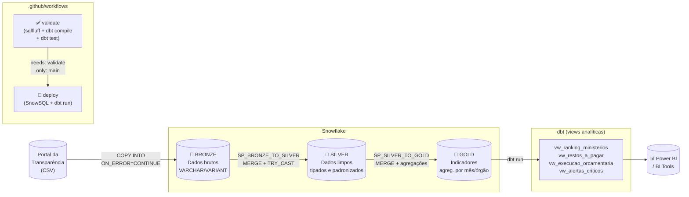

# Dados Governo Brasil v3

> **Sobre esta versão:** esta é a versão com arquitetura de engenharia de dados completa do projeto — Medallion, dbt e CI/CD — agora também com achados de negócio próprios (seção abaixo), gerados a partir do dado real e atualizado que passa por este pipeline. Para uma leitura mais aprofundada sobre o mesmo tema com um exercício anterior, veja **[dados-governo-brasil-v2](https://github.com/marciomichelotto/dados-governo-brasil-v2)**.

Pipeline de dados em **Snowflake + dbt** para ingestão, tratamento e análise de despesas públicas federais em arquitetura **Medallion (Bronze → Silver → Gold)** — com carga incremental via `MERGE`, testes automatizados de qualidade e CI/CD com validação obrigatória antes do deploy.

---

## 🎯 O problema que este projeto resolve

O [Portal da Transparência](https://portaldatransparencia.gov.br) disponibiliza dados brutos de despesas por órgão em CSV — mas o formato muda sem aviso, os números usam padrão brasileiro (vírgula decimal, ponto de milhar) e datas chegam como texto (`mar/25`). Sem um pipeline estruturado, qualquer análise começa com horas de limpeza manual.

Este projeto automatiza esse processo de ponta a ponta, permitindo responder perguntas como:

- Quais ministérios têm **menor taxa de execução orçamentária**?
- Quais órgãos acumulam **alto volume de restos a pagar** — indicador crítico de risco fiscal?
- Como a execução evoluiu mês a mês ao longo do ano?

---

## 📊 Achados

Direto das 4 views gold, sobre dado real do Portal da Transparência
(competência mar/25–nov/25, 35 órgãos superiores, **R$ 4,86 trilhões pagos
no período**).

**3 ministérios concentram 55% de tudo que foi pago.**

| Ministério | Total pago | % do total | Taxa de execução |
|---|---|---|---|
| Fazenda | R$ 2,67 tri | 55,0% | 97,3% |
| Previdência Social | R$ 1,07 tri | 22,0% | 94,4% |
| Saúde | R$ 224,4 bi | 4,6% | 90,2% |

Fazenda não é ministério operacional — boa parte desse valor é rolagem e
pagamento de dívida pública, não política pública (leitura aprofundada em
[dados-governo-brasil-v2](https://github.com/marciomichelotto/dados-governo-brasil-v2)).

**2 ministérios pagam mais da metade do empenhado do ano passado só em restos a pagar.**

| Ministério | % do empenhado em restos | Nível |
|---|---|---|
| Empreendedorismo, Microempresa e Pequena Empresa | 56,3% | Risco Extremo |
| Mulheres | 56,1% | Risco Extremo |
| Turismo | 36,9% | Risco Alto |

Esses órgãos gastam boa parte do ano quitando o passado, não executando o
orçamento do próprio exercício.

**327 combinações mês × órgão em alerta crítico absoluto** — restos a pagar
maior que o próprio empenhado do mês — de 883 linhas totais na tabela de
alertas, distribuídas em 3 níveis de criticidade.

**A taxa de execução mensal, tirada por média simples entre meses, produz
número sem sentido em alguns ministérios** — até 1.332% de "execução" no
Ministério das Mulheres, porque um mês teve `valor_empenhado` perto de zero
e a média das razões mensais explode. Não escondido: é uma fragilidade real
de `vw_execucao_orcamentaria` (falta guarda contra denominador pequeno), não
corrigida nesta rodada — no Power BI, a medida certa pondera pelo total do
período (`SUM(pago) / SUM(empenhado)`), nunca pela média das taxas mensais.

---

## 🏗️ Arquitetura


```mermaid
flowchart LR
    A[("Portal da\nTransparência\n(CSV)")] -->|COPY INTO\nON_ERROR=CONTINUE| B

    subgraph Snowflake
        B[("🥉 BRONZE\nDados brutos\nVARCHAR/VARIANT")]
        -->|SP_BRONZE_TO_SILVER\nMERGE + TRY_CAST| C

        C[("🥈 SILVER\nDados limpos\ntipados e padronizados")]
        -->|SP_SILVER_TO_GOLD\nMERGE + agregações| D

        D[("🥇 GOLD\nIndicadores\nagreg. por mês/órgão")]
    end

    D -->|dbt run| E

    subgraph dbt ["dbt (views analíticas)"]
        E["vw_ranking_ministerios\nvw_restos_a_pagar\nvw_execucao_orcamentaria\nvw_alertas_criticos"]
    end

    E --> F[("📊 Power BI\n/ BI Tools")]

    subgraph CI/CD [".github/workflows"]
        G["✅ validate\n(sqlfluff + dbt compile\n+ dbt test)"]
        -->|needs: validate\nonly: main| H["🚀 deploy\n(SnowSQL + dbt run)"]
    end
```

---

## 🧱 Camadas

### 🥉 Bronze
Ingestão bruta sem regras de negócio — preserva os dados originais.

| Tabela | Formato | Descrição |
|---|---|---|
| `TB_BRONZE_DESPESAS` | `VARIANT` | Ingestão via semi-estruturado |
| `TB_BRONZE_DESPESAS_V2` | `VARCHAR` | Staging estruturado para CSV/TSV |

### 🥈 Silver
Qualidade e padronização. Carga incremental via **MERGE** (idempotente).

| Tabela | Chave de negócio |
|---|---|
| `TB_SILVER_DESPESAS` | `orgao_subordinado_cod` + `mes_ano_dt` |

Transformações aplicadas:
- `mes_ano` (ex: `mar/25`) → `DATE` (primeiro dia do mês)
- Números BR (`1.234,56`) → `NUMBER(20,2)` via `TRY_CAST`
- Limpeza de aspas e espaços (`TRIM`)
- Campos de auditoria: `dt_carga_silver`, `arquivo_origem`

### 🥇 Gold
Camada analítica para consumo por BI e relatórios. Carga incremental via **MERGE**.

| Objeto | Tipo | Descrição |
|---|---|---|
| `TB_GOLD_DESPESAS_AGREG` | Tabela | Agregações por mês e órgão superior |
| `vw_ranking_ministerios` | dbt view | Ranking por volume de pagamentos |
| `vw_restos_a_pagar` | dbt view | Órgãos com maior acúmulo de RAP |
| `vw_execucao_orcamentaria` | dbt view | Eficiência: ALTA / MEDIA / BAIXA |
| `vw_alertas_criticos` | dbt view | Cruzamento: baixa execução + alto RAP |

---

## 📁 Estrutura do repositório

```
dados-governo-brasil-v3/
│
├── .github/
│   └── workflows/
│       └── deploy.yml          # CI: validate → deploy (só main)
│
├── snowflake/
│   ├── setup/
│   │   ├── 01_database.sql     # Database, schemas, warehouse
│   │   ├── 02_stage.sql        # Stage externo (AWS S3) + file format
│   │   └── 03_tables.sql       # DDL Bronze, Silver e Gold
│   ├── procedures/
│   │   ├── sp_bronze_load.sql  # Carga Bronze via COPY INTO
│   │   └── sp_silver_clean.sql # Bronze→Silver e Silver→Gold (MERGE)
│   └── tasks/
│       └── orchestration.sql   # Cadeia de Tasks automáticas
│
├── scripts/
│   ├── deploy_snowflake.py     # Aplica setup + tabelas + procedures — idempotente
│   └── carrega_bronze.py       # Carrega o CSV baixado manualmente pro bronze, sem stage S3
│
├── dbt/
│   ├── dbt_project.yml
│   ├── packages.yml            # dbt-utils
│   ├── schema.yml              # Documentação + testes de qualidade
│   └── models/
│       └── gold/
│           ├── vw_ranking_ministerios.sql
│           ├── vw_restos_a_pagar.sql
│           ├── vw_execucao_orcamentaria.sql
│           └── vw_alertas_criticos.sql
│
└── README.md
```

---

## ⚙️ Pré-requisitos

- Conta Snowflake com permissões para criar objetos (DB, schema, stage, tabelas, procedures, tasks)
- Warehouse ativo (padrão: `COMPUTE_WH`)
- Stage externo configurado (`@AWS_STAGE`) com o arquivo `despesasPorOrgao(in).csv`
- Python 3.11+ com `dbt-snowflake` instalado
- GitHub Secrets configurados (ver seção CI/CD)

---

## 🚀 Execução (ordem sugerida)

### 1. Setup inicial no Snowflake

```sql
-- Execute nesta ordem:
-- 1. snowflake/setup/01_database.sql
-- 2. snowflake/setup/02_stage.sql
-- 3. snowflake/setup/03_tables.sql
```

### 2. Carga e transformações

**Sem stage S3 configurado** (caminho usado nesta rodada, com dado real):

```bash
# baixe despesasPorOrgao.csv manualmente em
# portaldatransparencia.gov.br/download-de-dados/despesas e salve em data/raw/
python scripts/deploy_snowflake.py   # aplica setup + tabelas + procedures
python scripts/carrega_bronze.py     # carrega bronze e chama SP_BRONZE_TO_SILVER()
```

**Com stage S3 configurado** (desenho original):

```sql
-- Bronze
CALL SP_BRONZE_LOAD();

-- Silver (MERGE — pode rodar N vezes sem duplicar)
CALL SP_BRONZE_TO_SILVER();

-- Gold (MERGE — agrega e calcula KPIs)
CALL SP_SILVER_TO_GOLD();  -- ver Pendências: redundante com as views dbt e quebrado
```

### 3. Orquestração automática (opcional)

```sql
-- Cria a cadeia de Tasks com agendamento via CRON:
-- snowflake/tasks/orchestration.sql
--
-- Resultado:
--   TASK_CARREGA_BRONZE → AFTER → TASK_BRONZE_TO_SILVER
--                                       → AFTER → TASK_SILVER_TO_GOLD
```

### 4. Modelos analíticos (dbt)

```bash
# Instalar dependências
dbt deps

# Rodar modelos Gold
dbt run --select gold

# Executar testes de qualidade
dbt test --select gold

# Documentação navegável (lineage graph)
dbt docs generate && dbt docs serve
```

---

## 🔎 Decisões técnicas

| Decisão | Alternativa descartada | Motivo |
|---|---|---|
| **MERGE** na Silver/Gold | `TRUNCATE + INSERT` | Idempotência: falha no meio não deixa tabela vazia |
| **`TRY_CAST`** para números | `CAST` direto | Dados do governo têm linhas malformadas; `CAST` quebraria a carga |
| **`ON_ERROR = 'CONTINUE'`** | Parar na primeira linha inválida | Preserva carga parcial; linhas ruins são investigadas depois |
| **`DATE_FROM_PARTS`** | Manter como `VARCHAR` | Permite filtros por range de datas, funções de janela e joins temporais |
| **dbt para Gold** | SP para tudo | dbt gera lineage graph, documentação e testes automatizados — ferramentas de BI entendem melhor |
| **MERGE com `ZEROIFNULL`** | Comparação direta `<>` | `NULL <> NULL` retorna `NULL` em SQL, não `TRUE` — sem isso o MERGE nunca detecta mudanças em campos nulos |

---

## ⚠️ Pendências conhecidas

- **Conta Snowflake migrada.** A conta original (`XRFLDVL-YCB69798`) expirou
  (trial vencido); os dados reais acima rodam numa conta trial diferente,
  mesmo database/schema (`GOV_V3.DADOS_GOV`). `dbt/profiles.yml` foi
  corrigido pra ler a senha de `SNOWFLAKE_PASSWORD` no ambiente em vez de
  texto plano — **a senha antiga ficou exposta publicamente neste repositório
  desde 13/05/2026 e deveria ser considerada comprometida.**
- **`schema.yml` (testes dbt) descreve um schema que nunca existiu** —
  `orgao_subordinado_cod`, `mes_ano_dt`, `taxa_execucao_pct`,
  `posicao_ranking`, entre outros, não batem com as colunas reais das views
  (`nome_ministerio`, `taxa_execucao`, `ranking_pago`...). `dbt run` funciona
  normalmente (testes não bloqueiam materialização), mas `dbt test`/`dbt
  build` falha até esse arquivo ser reescrito pra bater com as views reais.
- **`TB_GOLD_DESPESAS_AGREG` e `SP_SILVER_TO_GOLD` são redundantes e estão
  quebrados** — referenciam colunas que não existem nem na tabela que
  criam nem na Silver real. As 4 views dbt já cobrem o papel de gold
  diretamente a partir de `TB_SILVER_DESPESAS`; essa tabela/procedure
  paralela nunca chegou a rodar com dado real e não está no caminho ativo.
- **`SP_BRONZE_TO_SILVER` tinha um bug de conversão de data** que zerava a
  Silver inteira (`TRY_TO_DATE` esperava mês numérico; o Portal usa
  abreviação em português — `mar/25`, não `03/25`). Corrigido nesta rodada.
- **Sem stage S3 configurado** — `scripts/carrega_bronze.py` carrega o CSV
  baixado manualmente do Portal direto pro bronze, sem passar por
  `sp_bronze_load.sql`/`COPY INTO` (ver seção Execução).
- As 4 views gold materializaram como **tabela no schema `DADOS_GOV`**
  nesta rodada, não como view no schema `gold` (configuração de
  `schema.yml` não teve efeito — mesma causa raiz do item acima).

---

## 🧪 Consultas de exemplo

```sql
-- Top 5 ministérios por valor pago (últimos 3 meses)
SELECT orgao_superior, SUM(total_pago) AS total_pago
FROM TB_GOLD_DESPESAS_AGREG
WHERE mes_ano_dt >= DATEADD(month, -3, CURRENT_DATE())
GROUP BY orgao_superior
ORDER BY total_pago DESC
LIMIT 5;

-- Órgãos em alerta crítico (baixa execução + alto RAP)
SELECT * FROM vw_alertas_criticos
WHERE nivel_criticidade = 'CRITICO'
ORDER BY proporcao_restos_pct DESC;

-- Evolução mensal da taxa de execução por ministério
SELECT mes_ano_dt, orgao_superior, taxa_execucao_pct
FROM TB_GOLD_DESPESAS_AGREG
ORDER BY orgao_superior, mes_ano_dt;
```

---

## 🔄 CI/CD

O pipeline de CI/CD roda automaticamente a cada push:

```
push (qualquer branch)
    │
    ▼
✅ validate         ← obrigatório, bloqueia o deploy
   • sqlfluff lint  (estilo e sintaxe SQL)
   • dbt compile    (Jinja + YAML válidos, sem conexão)
   • dbt test       (qualidade dos dados via schema.yml)
    │
    │  somente se validate passou E branch = main
    ▼
🚀 deploy
   • SnowSQL: procedures + tasks
   • dbt run: modelos Gold
```

**Secrets necessários** (Settings → Secrets → Actions):

| Secret | Exemplo |
|---|---|
| `SNOWFLAKE_ACCOUNT` | `XRFLDVL-YCB69798` |
| `SNOWFLAKE_USER` | `MARCIOMICHELOTTO` |
| `SNOWFLAKE_PASSWORD` | `****` |
| `SNOWFLAKE_DATABASE` | `GOV_V3` |
| `SNOWFLAKE_WAREHOUSE` | `COMPUTE_WH` |
| `SNOWFLAKE_SCHEMA` | `DADOS_GOV` |
| `SNOWFLAKE_ROLE` | `SYSADMIN` |

---

## 👥 Público-alvo

- Times de dados governamentais e de controle orçamentário
- Analistas de orçamento público e transparência fiscal
- Squads de BI/Analytics com foco em dados do setor público

---

## 🛠️ Stack


